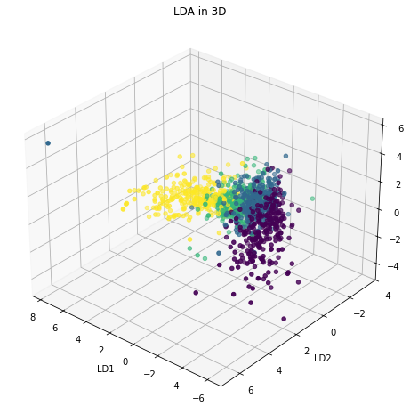

# LDA & DBSCAN for Outliers detection in Classification
In this house price classification task, a combination of **Linear Discriminant Analysis** (LDA) and **DBSCAN** was employed to tackle the challenge of **intraclass outlier detection**. The initial analysis revealed the difficulty of distinguishing between **consecutive price classes**. It was observed that in the LDA space, records from **consecutive price classes** formed **adjacent clusters**, leading to the application of the DBSCAN algorithm to the individual classes (clusters) within the LDA space to eliminate records located **between two clusters**,  that were likely causing the misclassification problem. This approach **significantly improved the Precision** of the classification algorithms being investigated. Additionally, feature selection was performed on a substantial set of both categorical and continuous features. Through the use of the **chi-squared test**, the **feature permutation algorithm**, and discrimination based on feature **entropy and distribution**, the feature space dimension was drastically reduced while retaining the essential characteristics that **determine house prices**_.
##  Feature Elimination

Given the **high dimensionality** of the dataset, it was necessary to identify which features could be **eliminated**. For **categorical attributes**, histograms were analyzed, where the distribution of records from various classes was highlighted in each bar. An **optimal categorical feature** not only has observations evenly distributed among its categories but also tends to associate each class with a **unique value**, making it possible to distinguish between them by simply observing the attribute.

In addition to histograms, **Shannon entropy** was calculated for each attribute to quantitatively measure the **quality** of each categorical feature. **High entropy** indicates a well-distributed attribute that is rich in information. Features with **low entropy** were considered less informative and candidates for elimination.

  
  

  <em>Respectively, a highly (right) informative and a less(left) informative feature</em>

Furthermore, the potential **correlation** among subsets of categorical features was addressed. Strong correlations between features could interfere with the **Feature Permutation** algorithm, which was later used for **Feature Selection**. Therefore, a **chi-square independence test** was performed on categorical features. The resulting **correlation matrix** was examined both **before** and **after**, eliminating features based on histogram analysis and entropy. It was observed that most of the **correlated feature pairs** were eliminated following the screening process.

  
  

  <em>Chi-Square Test Correlation Matrix Before (left) and After (right) Feature Elimination</em>

##  Intraclass Outlier Detection using **LDA** and **DBSCAN**

Initially, an **outlier detection** strategy was adopted by removing records outside the range between the **0.01%** and **99% quantiles** of individual quantitative features. However, after training several classifiers, it was observed that the **confusion matrix** showed that most classification errors resulted from records of a certain label being incorrectly classified as belonging to **adjacent price classes** (those just above or below). This suggests that in the **feature space**, there might be overlapping regions between samples of different classes but with similar characteristics. These "**grey areas**" create difficulties for classifiers in determining the boundaries between classes, leading to classification errors predominantly for records located at the margins between two classes in the feature space.

Our hypotheses were confirmed by the **Linear Discriminant Analysis (LDA)** plot, which, unlike **Principal Component Analysis (PCA)**, explicitly considers the **class structure** during dimensionality reduction. The plot shown in **Figure 3** demonstrates how, in the space of the three components calculated by **LDA**, the data belonging to **price classes 1, 2, and 3** are distributed as adjacent clusters with overlapping zones where records from both classes are found, while the cluster for **class 0** is positioned between the three.

Therefore, a more refined outlier detection technique was adopted, aimed at eliminating outliers relative to the entire dataset and those specific to individual classes. This technique involved applying the **DBSCAN clustering algorithm** on the data in the reduced feature space obtained through **LDA**. **DBSCAN** was chosen for its ability to identify clusters of arbitrary shapes and for its effectiveness in detecting outliers as points that do not belong to any cluster. Each price class was treated independently, and the algorithm was applied to detect and remove outliers within each class.

  
  

  <em>Figure 3 and Figure 4: LDA Plot of Test Set. Different colours correspond to different classes.</em>

**Download and explore the interactive 3D LDA plots inside the folder Interactive_3D_LDA_graphs!**
