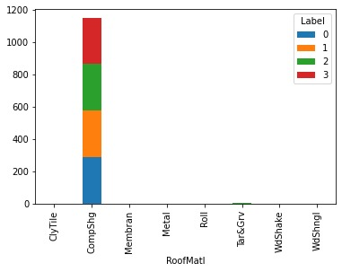
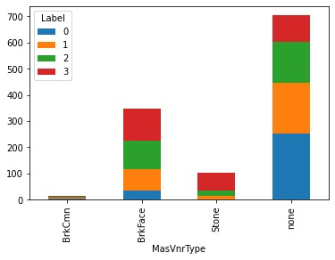
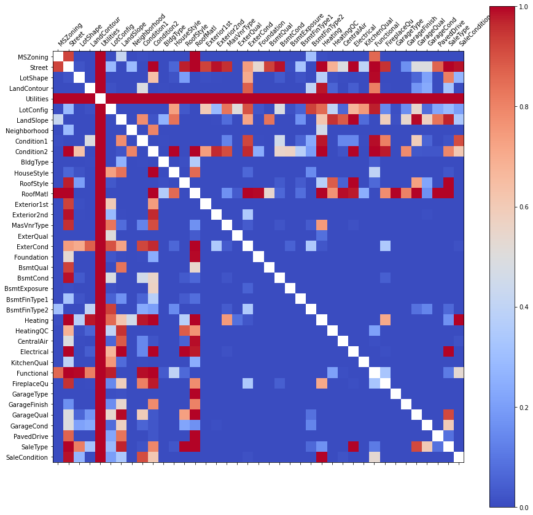
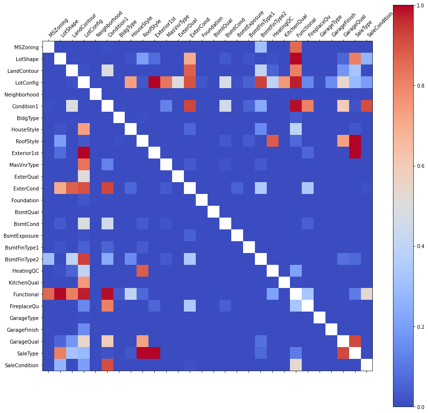

# LDA & DBSCAN for Outliers detection in Classification
A house price classification task, where Linear Discriminanat Analysis (LDA) and DBSCAN are combined to perform a crucial Intraclass outlier detection.
A first analysis underlined the difficulty of discriminating between adjacent (consecutive) price classes; after noticing that in the LDA (Linear Discriminant Analysis) space, the records belonging consecutive price classes are distributed as adjacent clusters, the application of the DBSCAN algorithm to the single classes (cluster), aiming to eliminate those records lying in the region between two clusters, resulted in an effective method that enhanced the Precision of the classification algorithms tested.
A feature selection process has also been executed on the substantial (~50) categorical and continuous feature sets. The chi-squared test, feature permutation algorithm, and discrimination based on the feature's entropy and distribution have drastically reduced the feature space dimension preserving the essential characteristics determining the price of a house.
## B. Feature Elimination

Given the **high dimensionality** of the dataset, it was necessary to identify which features could be **eliminated**. For **categorical attributes**, histograms were analyzed, where the distribution of records from various classes was highlighted in each bar. An **optimal categorical feature** not only has observations evenly distributed among its categories, but also tends to associate each class with a **unique value**, making it possible to distinguish between them by simply observing the attribute.

In addition to histograms, **Shannon entropy** was calculated for each attribute to quantitatively measure the **quality** of each categorical feature. **High entropy** indicates a well-distributed attribute that is rich in information. Features with **low entropy** were considered less informative and candidates for elimination.

<table border="0">
  <tr>
    <td>
      
      <em>Figure 1: Roof Material Histogram (Low Informative Feature)</em>
    </td>
    <td>
      
      <em>Figure 2: MasVnrType Histogram (High Informative Feature)</em>
    </td>
  </tr>
</table>

Furthermore, the issue of potential **correlation** among subsets of categorical features was addressed. Strong correlations between features could interfere with the **Feature Permutation** algorithm, which was later used for **Feature Selection**. Therefore, a **chi-square independence test** was performed on the set of categorical features. The resulting **correlation matrix** was examined both **before** and **after** eliminating features based on histogram analysis and entropy. It was observed that most of the **correlated feature pairs** were eliminated following the screening process.

## Figures

<table style="border-collapse: collapse;">
  <tr>
    <td style="border: none;">
      
      <em>Figure 3: Chi-Square Test Correlation Matrix (Before Feature Elimination)</em>
    </td>
    <td style="border: none;">
      
      <em>Figure 4: Chi-Square Test Correlation Matrix (After Feature Elimination)</em>
    </td>
  </tr>
</table>
