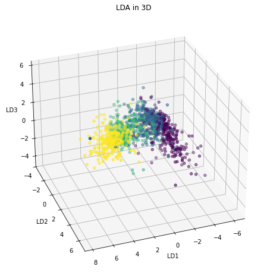

# LDA & DBSCAN for Outliers detection in Classification
In this house price classification task, a combination of **Linear Discriminant Analysis** (LDA) and **DBSCAN** was employed to tackle the challenge of **intraclass outlier detection**. The initial analysis revealed the difficulty of distinguishing between **consecutive price classes**. It was observed that in the LDA space, records from **consecutive price classes** formed **adjacent clusters**, leading to the application of the DBSCAN algorithm to the individual classes (clusters) within the LDA space to eliminate records located **between two clusters**,  that were likely causing the misclassification problem. This approach **significantly improved the Precision** of the classification algorithms being investigated. Additionally, feature selection was performed on a substantial set of both categorical and continuous features. Through the use of the **chi-squared test**, the **feature permutation algorithm**, and discrimination based on feature **entropy and distribution**, the feature space dimension was drastically reduced while retaining the **essential characteristics that determine house prices**.
##  Feature Elimination

Given the **high dimensionality** of the dataset, it was necessary to identify which features could be **eliminated**. For **categorical attributes**, histograms were analyzed, where the distribution of records from various classes was highlighted in each bar. An **optimal categorical feature** not only has observations evenly distributed among its categories but also tends to associate each class with a **unique value**, making it possible to distinguish between them by simply observing the attribute.

In addition to histograms, **Shannon entropy** was calculated for each attribute to quantitatively measure the **quality** of each categorical feature. **High entropy** indicates a well-distributed attribute that is rich in information. Features with **low entropy** were considered less informative and candidates for elimination.

  
  

  <em>Respectively, a highly (right) informative and a less(left) informative feature</em>

Furthermore, the potential **correlation** among subsets of categorical features was addressed. Strong correlations between features could interfere with the **Feature Permutation** algorithm, which was later used for **Feature Selection**. Therefore, a **chi-square independence test** was performed on categorical features. The resulting **correlation matrix** was examined both **before** and **after** eliminating features based on histogram analysis and entropy. It was observed that most of the **correlated feature pairs** were eliminated following the screening process.

  
  

  <em>Chi-Square Test Correlation Matrix Before (left) and After (right) Feature Elimination</em>

##  Intraclass Outlier Detection using **LDA** and **DBSCAN**

Initially, an **outlier detection strategy** was employed that involved the removal of records falling outside the range between the 0.01% and 99% quantiles of individual quantitative features. However, it was later discovered through analysis that most classification errors were being observed when records of a **certain label were inaccurately classified** as belonging to **adjacent price classes**. This was indicative of overlapping regions between samples of different classes, creating challenges for classifiers in accurately determining class boundaries. These issues were predominantly faced with records situated at the margins between two classes. 

Confirmation of our hypotheses came through the **Linear Discriminant Analysis (LDA)** plot, which, by taking class structure into account during dimensionality reduction, **highlighted adjacent clusters with overlapping zones** for price classes 1, 2, and 3, whereas class 0 was positioned distinctly between them. 

A more refined outlier detection technique was then adopted, **utilizing the DBSCAN clustering algorithm in the reduced feature space** achieved through LDA. The choice of DBSCAN was due to its capability of identifying clusters of arbitrary shapes and detecting outliers as points not belonging to any cluster. This technique entailed the independent application of DBSCAN to each price class for the detection and removal of outliers within each class.

  
  

  <em>Figure 3 and Figure 4: LDA Plot of Test Set. Different colours correspond to different classes.</em>

**Download and explore the interactive 3D LDA plots inside the folder Interactive_3D_LDA_graphs!**
